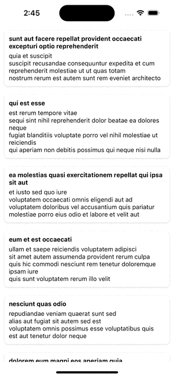

# Infinite Scrolling Project (React + ViteJS & React Native)

This project implements high-performance infinite scrolling for both web (ViteJS) and mobile (React Native) applications using a shared business logic approach with symbolic links.

## 📁 Project Structure

```
project-root/
  ├── mobile/
  │   └── src/
  │       └── shared/    # Symbolic link to shared business logic
  ├── web/              # Web app (Vite + React)
```

## 🌟 Features

- Shared business logic via symbolic links.
- Infinite scrolling with dynamic data fetching.
- Virtualization for optimized rendering.
- React hooks with memoization.

## 🛠️ Technologies

- **Web:** React with ViteJS
- **Mobile:** React Native
- **API:** [JSONPlaceholder](https://jsonplaceholder.typicode.com)
- **Shared Logic:** React hooks

## Project demo

#### Web


#### iOS & Android

<div style="display: flex; justify-content: space-between;">
  
  
</div>

## 📌 Setup Instructions

### 1. Clone Repository

```bash
git https://github.com/naveen204pauly/Talent-Arabia-Assessment.git
cd Talent-Arabia-Assessment
```

### 2. Create Symbolic Link for Shared Logic

```bash
cd InfiniteScrollMobile/src
ln -s ../../shared shared
```

### 3. Install Dependencies

#### Web (ViteJS):

```bash
cd InfiniteScrollWeb
npm install
```

#### Mobile (React Native):

```bash
cd mobile
npm install
```

Install the pod (iOS):

```sh
cd ios && pod install
```

### 4. Run Applications

#### Web:

```bash
cd web
npm run dev
```

#### Mobile:

```bash
cd mobile
npx react-native run-android  # For Android
npx react-native run-ios      # For iOS
```

## 🚀 Optimization Techniques Used

- **Symbolic Links:** Simplify shared logic management.
- **Memoization:** Use `useMemo` and `useCallback` for performance.
- **Virtualization:** `FlatList`.

## 💡 Conclusion

This project demonstrates how to reuse business logic efficiently between web and mobile platforms using symbolic links, ensuring scalability and maintainability.
